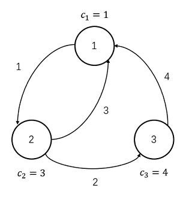

Time limit per test : $\texttt{2 s}$

Memory limit per test : $\texttt{512 MB}$

You can submit this problem at:

+ [LibreOJ](https://loj.ac/problem/3339)
    - Input: `delicacy.in`
    - Output: `delicacy.out`
+ [Luogu](https://www.luogu.com.cn/problem/P6772)
+ [UOJ](https://uoj.ac/problem/558)

## Description

After repelling the invasion of the Legion and more than ten years of recuperation, the Elven Kingdom located on the continent of Bzeroth, has become a thriving paradise again, attracting tourists throughout the world. Little W is a famous foodie who has traveled all over the world, and now he also came to this kingdom.

There are $n$ cities in the kingdom, numbered from $1$ to $n$. The food in city $i$ can provide Little W with a pleasure points of $c_i$. The cities of the kingdom are connected by $m$ **directed** roads, numbered from $1$ to $m$. The $i$-th road starts from city $u_i$ and ends at city $v_i$, and it takes $w_i$ days to travel along it. In other words, if Little W travels along road $i$ from city $u_i$ on the $d$-th day, he will reach the city $v_i$ on the $(d+w_i)$-th day.

Little W plans a travel of $T$ days in the kingdom, more specifically: he will depart from city $1$ on Day $0$, and finally return to city $1$ on Day $T$. Since Little W is a foodie, whenever he arrives in a city (including the city $1$ on Day $0$ and Day $T$), he will taste the food of the city and get the pleasure points it provides. **If Little W arrives in the same city multiple times, he will get the pleasure points multiple times.** Note that W **CANNOT** stop in any city during the trip, that is, when he arrives in a city but his trip doesn't finish, he must depart from that city at the same day.

In addition, the Elven Kingdom will hold $k$ food festivals **at different times**. Specifically, the $i$-th food festival will be held in city $x_i$ on the $t_i$-th day. If Little W happens to be in city $x_i$ on Day $t_i$, he will get an extra pleasure points of $y_i$ when he tastes the food in city $x_i$. Now Little W would like to ask you, the reception envoy of the Elven Kingdom, to help him calculate the **maximum** of the sum of pleasure points he can get during his travel.

## Input

The first line contains $4$ integers $n (1 \leq n \leq 50)$, $m (n \leq m \leq 501)$, $T (1 \leq T \leq 10^9)$ and $k (0 \leq k \leq 200)$, indicating the number of cities, roads, days of travel and food festival respectively.

The second line contains $n$ integers $c_i (1 \leq c_i \leq 52501)$, indicating the pleasure point that the food of each city can provide.

Each of the next $m$ lines contains $3$ integers $u_i, v_i, w_i (u_i \neq v_i, 1 \leq u_i, v_i \leq n, 1 \leq w_i \leq 5)$, describing a road.

Each of the next $k$ lines contains $3$ integers $t_i, x_i, y_i (1 \leq t_i \leq T, 1 \leq x_i \leq n, 1 \leq y_i \leq 10^9)$, describing a food festival.

It's guaranteed that:

+ For each city, there are at least $1$ road start from it.
+ All the $t_i$ are pairwise distinct.

## Output

Print a single integer — the maximal pleasure points he can get.

**If Little W can't return city $1$ on Day $T$, print `-1`.**

## Samples

### Sample 1
#### Input
```plain
3 4 11 0
1 3 4
1 2 1
2 1 3
2 3 2
3 1 4

```
#### Output
```plain
13

```
#### Explanation



As the picture shown above, the optimal plan is $1 \rightarrow 2 \rightarrow 1 \rightarrow 2 \rightarrow 3 \rightarrow 1$.

+ On Day $0$, Little W start his travel from city $1$, get $1$ pleasure point and sets off for city $2$.
+ On Day $1$, Little W arrives at city $2$, get $3$ pleasure points and sets off for city $1$.
+ On Day $4$, Little W arrives at city $1$, get $1$ pleasure point and sets off for city $2$.
+ On Day $5$, Little W arrives at city $2$, get $3$ pleasure points and sets off for city $3$.
+ On Day $7$, Little W arrives at city $3$, get $4$ pleasure points and sets off for city $1$.
+ On Day $11$, Little W arrives at city $1$, get $1$ pleasure point and end his travel.
+ Little W get $13$ pleasure points in total.

So the minimal anxiety is $94$.

### Sample 2
#### Input
```plain
4 8 16 3
3 1 2 4
1 2 1
1 3 1
1 3 2
3 4 3
2 3 2
3 2 1
4 2 1
4 1 5
3 3 5
1 2 5
5 4 20

```
#### Output
```plain
39

```
#### Explanation

The optimal plan is $1 \rightarrow 3 \rightarrow 4 \rightarrow 2 \rightarrow 3 \rightarrow 4 \rightarrow 1$.

### Sample 3

Please check the other samples at `NOI/2020/Day1-samples.zip`.

## Subtasks

For partial scores, you can look up at the origin statement (`NOI/2020/Day1.pdf`).
